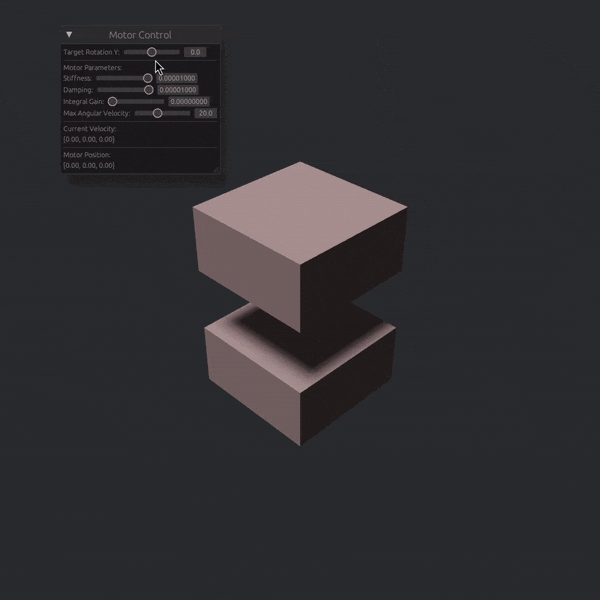

# Avian Motors

The `avian_motors` crate provides a modular motor control system for use with the `avian3d` physics engine and the `bevy` game engine. Proper motor joints are a planned feature of Avian, so this will hopefully be obsolete soon.

Currently, only revolute joints are supported, but prismatic, spherical, planar, and distance joints are planned.

## Features

- Velocity or position control of revolute joints.
- Examples of motor implementation in `examples/`.
- `f32` and `f64` support (default is `f64`) using the `f64` or `f32` feature flags.
  - `f32` works very poorly though, and is not recommended.

## Getting Started

### Prerequisites

This library requires `bevy` and `avian3d` as dependencies:

- `bevy = "0.14"`
- `avian3d = "0.1"`

### Installation

Add the following dependencies to your `Cargo.toml`:

```toml
[dependencies]
avian_motors = "0.1.0"
bevy = "0.14"
avian3d = { version = "0.1", default-features = false, features = [
  "3d",
  "f64",
  "default-collider",
  "parry-f64",
  "collider-from-mesh",
  "parallel",
  "simd"
] }
```

## Example Usage

Some basic examples are provided in the `examples/` directory.

`cargo run --example revolute_position` to control a revolute joint with position control.


`cargo run --example revolute_velocity` to control a revolute joint with velocity control.

